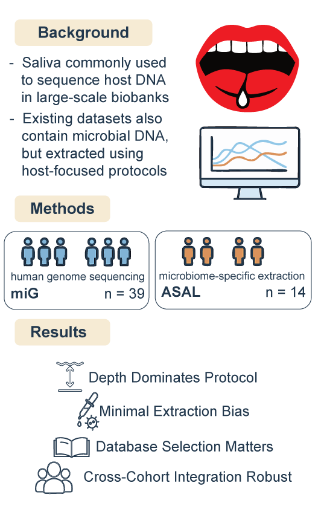

This repository contains the data and scripts necessary to reproduce all figures in the paper: *“Human whole-genome sequencing as a resource for salivary microbiome profiling.”* The study evaluates whether standard host-DNA extraction protocols can reliably support salivary microbiome profiling when paired with deep shotgun sequencing.

This analysis compares two saliva sample sets:

- **miG**: Collected using Oragene saliva kits (DNA Genotek™) and extracted using Maxwell magnetic bead–based technology (PROMEGA™). Sequenced on an Illumina NovaSeq 6000 with the TruSeq PCR-free protocol.  
- **ASAL**: Fastq files downloaded from ENA under accession [PRJEB57658](https://www.ebi.ac.uk/ena/browser/view/PRJEB57658). DNA was extracted using two microbiome-oriented protocols and sequenced using the Ion Proton platform.

All data used in this analysis were processed for human read removal and taxonomic profiling as described in the manuscript.

Both datasets were analyzed using:
- [`meteor`](https://github.com/metagenopolis/meteor): for genome coverage–based profiling using their [saliva-specific microbial reference database](https://zenodo.org/records/14181351).
- [`sylph`](https://github.com/bluenote-1577/sylph): for broad taxonomic classification using the [GTDB](https://gtdb.ecogenomic.org/) (release R220, April 2024).

 

## 📌 TL;DR

<strong> Background</strong>

The salivary microbiome is a key indicator of health and immunity. Although saliva samples are commonly collected in genomic biobanks for human DNA sequencing, the extraction protocols used are typically not tailored for microbial recovery, raising questions about their suitability for microbiome profiling.

<strong> Key Findings</strong>

- Deep sequencing compensates for the lack of microbial-specific extraction.
- Higher microbial richness and reproducibility in miG samples.
- Species-level resolution is maintained even without lysis-focused protocols.
- Community structures converge between protocols after rarefaction.
- miG shows lower variability at fine taxonomic levels (per FAVA).

---

## 📁 Repository structure

- `data/`: taxonomy files (taxon tables output of sylph and meteor)  
- `figures/`: Exported figures from the manuscript  
- `notebooks/`: Jupyter notebooks for exploratory analyses and used to generate each figure (with the R kernel)
- `scripts/`: helper functions to carry out analysis

Each of the three figures/analyses presented in the paper corresponds to a different Jupyter notebook in the `notebooks/` repository:

1. `Figure1_taxon_detection.ipynb`

2. `Figure2_jaccard_pcoa.ipynb`

3. `Figure3_FAVA.ipynb`

4. `Figure4.ipynb` 

